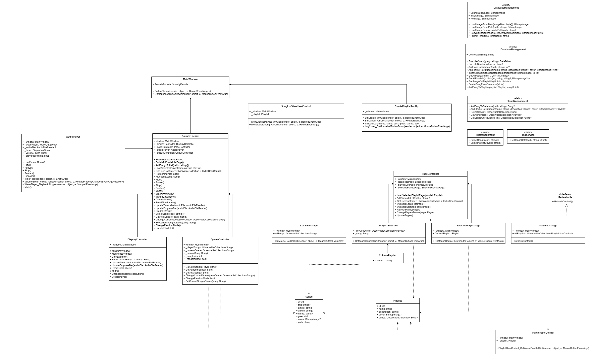

# SoundBuddy - lokalny odtwarzacz mp3 💿🎹

#### SoundBuddy to lokalny odtwarzacz mp3 pozwalający na dodawanie utworów mp3 znajdujących się na twoim komputerze, grupowanie je w playlisty oraz przed wszystkim odtwarzanie ich.

Aplikacja została stworzona w ramach projektu na zajęciach "Wzorce projektowe".
Dokumentacja składa się z tego dokumnetu, zawierającego opisy działania, poszczególnych struktur oraz diagarmu klas.

**Autor:** Jakub Magiera

## Działanie

Podczas dodawania utworu do odtwarzacza, w bazie zapisywana jest jego ścieżka. Następnie program pobiera dane utworu tj. tytuł, autorzy, gatunek, okładka itp. i przechowuje je w odpowiedniej liście, umożliwiającej synchronizację z wyświetlanymi elementami. Użytkownik może tworzyć własne playlisty, których nazwa, opis i okładka typu .png zostają zapisane w bazie.
Aplikacja pozwala na odtwarzanie, pauzowanie, zatrzymywanie, przewijanie piosenek oraz odtwarzanie ich w losowej kolejności, bądź ustalonym porządku. Piosenki można usuwać z odtwarzacza, zarówno przez wybranie opcji "Delete" w wyświetlanym menu, jak i przez zmianę lokalizacji utworu na komputerze.

## Funkcjonalności

- **Odtwarzanie utworów**
  - **Odtwarzanie** *Play*
  - **Pauzowanie** *Pause*
  - **Natępny utwó**r *Next*
  - **Odwtorzenie od początku** *Previous*
  - **Zatrzymanie** *Stop*
  - **Losowa kolejność odtwarzania**

- **Sterowanie dźwiękiem**
  - **Zmiana głośności**
  - **Wyciszenie** *Mute*

- **Zarządzanie playistami**
    - **Dodawanie playlist**
        - **Wybór nazwy**
        - **Opcjonalny wybór opisu**
        - **Opcjonalny wybór okładki**
    - **Wybór playlisty do wyświetlenia / odtworzenia**
    - **Usuwanie playlist** (w trakcie implementacji)

- **Zarządzanie piosenkami**
  - **Dodawanie do konkretnej, istniejącej playlisty**
  - **Usuwanie piosenki z odtwarzacza**

## Wzorce projektowe

Aplikacja opiera się głownie na dwóch wzorach projektowych:
### **MVC - Model View Controller**
  - #### Modele:
    - **Song**
    - **Playlist**

  - #### Widoki:
    - ##### Okna / strony:
      - **MainWindow**
      - **LocalFilesPage**
      - **PlaylistListPage**
      - **SelectedPlaylistPage**
    - ##### PopUp'y:
      - **CreatePlaylistPopUp**
      - **PlaylistSelection**
    - ##### UserControls (elementy składowe okna / strony):
      - **PlaylistUserControl**
      - **SongListViewUserControl**

  - #### Kontrolery:
     - **DisplayController**
     - **PageController**
     - **QueueController**
     - **AudioPlayer**
     - inne klasy statyczne, które nie wymagają istnienia konkretnej klasy, a są wykorzysytwane w wielu klasach tj. *TagService* (zarządzanie danymi utworu)

### **Facade**
  - **SoundyFacade** - klasa łącząca wszystkie kontrolery oraz główne okno, umożliwiająca działanie wszystkich klas bez nadmiarowych referencji do innych obiektów klas

## Diagram klas

## Baza danych

W projekcie został wykorzystany system zarządzania relacyjną bazą danych SQLite. 
Baza składa się z trzech tabel:

- **Songs** (Id: integer, Path: text)
- **Playlists** (Id: integer, Name: integer, Description: text?, Picture: blob?)
- **SongsOnPlaylists** (SongId: integer, PlaylistId: integer)

## Wykorzystane technologie

Odtwarzacz został napisany w języku C#. Do interfejsu graficznego wykorzystywany jest Windows Presentation Foundation. 

Zewnętrzne pakiety:

- **NAudio** *NAudio, an audio library for .NET* by Mark Heath & Contributors
- **NAudio.Lame** *Uses libmp3lame.dll from the Lame project to provide MP3 encoding support to NAudio 2.0.  Both 64-bit and 32-bit versions of libmp3lame.dll are provided, with platform detection to determine which to use.* by Corey Murtagh
- **System.Data.SQLite** *The official SQLite database engine for both x86 and x64 along with the ADO.NET provider.  This package includes support for LINQ and Entity Framework 6.* by SQLite Development Team
- **TagLibSharp** *A library for for reading and writing metadata in media files, including video, audio, and photo formats.* by Brian Nickel, Gabriel Burt, Stephen Shaw, etc

## Minimalne wymagania systemowe i sprzętowe

- **Windows XP z Service Pack 2 lub nowszy**
- **.NET Framework 8.0**
- **\> 800MHz Procesor**
- **512 MB RAM**
- **DirectX 9 lub nowszy**

Wymagania systemowe zostały określone na podstawie wymagań WPF.

## Bezpieczeństwo

Aplikacja nie jest odporna na ataki typu SQL Injection. Jednak przez to, że baza danych działa tylko lokalnie na komputerze użytkownika, potencjalny atak jedynie ujawniłby dane, które użytkownik już zna lub nic nie znaczące w tym przypadku numery ID.